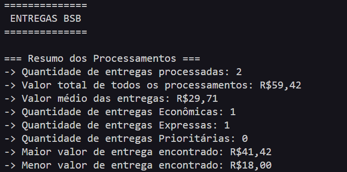

# Trabalho Bimestral de Lógica de Programação e Algoritmos - Sistema em C para Controle de Entregas


Sistema desenvolvido em linguagem de programação C para o controle e cálculo de valores de uma empresa de entregas.

## 📜Sobre
Trabalho individual proposto nas IES Universidade Católica de Brasília, em prol da avaliação do aprendizado para com a linguagem de programação de baixo nível C na disciplina de Lógica de Programação e Algoritmos. O cenário abordado trata-se de uma companhia de entregas de mercadorias. 
- Prazo de entrega: 25/09/2026;
- Período: 1º Bimestre/2º Semestre;

### 🏷️Tópicos abordados
- **Entrada e saída de dados**;
- **Identificadores, variáveis, constantes e tipos adequados**;
- **Operadores**;
- **Estruturas de repetição e decisão**;
- **Procedimentos e funções**;
- **Parâmetros e valores de retorno**;

## 🗂️Arquivos
- `main.c`: Fluxo principal do programa.
- `entrega.h`: Header de definições para funções e procedimentos.
- `entrega.c`: Funções e procedimentos para uso.

## 🖱️Como executar
Para execução e compilação, execute os seguintes comandos no terminal.

```
gcc main.c entrega.c -o main
```
```
./main
```
*(Uso do cmd tradicional)*
```
main.exe
```

❗*No caso do uso da IDE VS Code, recomenda-se o uso da extensão Code Runner(Jun Han) em conjunto da C/C++(Microsoft)*

## 🛠️Funcionalidades
- Entrada de dados relacionados a entrega, sendo distância, peso, modalidade de entrega, adesão do serviço de proteção e tentativas adicionais de entrega;
- Saída do valor total de entrega com base nos valores informados;
- Síntese do processamento total do programa quando solicitado pelo usuário.

## 🗃️Disposição das soluções
Na aplicação, focou-se na abstração de múltiplas ocorrências no fluxo principal do programa(`main.c`), dividindo as necessidades de procedimentos de estilo e amostragem de informações e funções de validação/cálculo em `entrega.c`.

## 🖥️ Exemplo de execução



## 📌Observações
A aplicação foi inteiramente desenvolvida de maneira **individual**.

### 🤖Uso de Inteligência Artificial
Durante o processo de desenvolvimento, foram feitos usos da IA Claude Chat, em todos os casos, para avaliação de blocos de códigos específicos, juntamente do apontamento de erros/ineficiências nos mesmos, tendo como ponto principal a explicação detalhada de soluções viáveis.